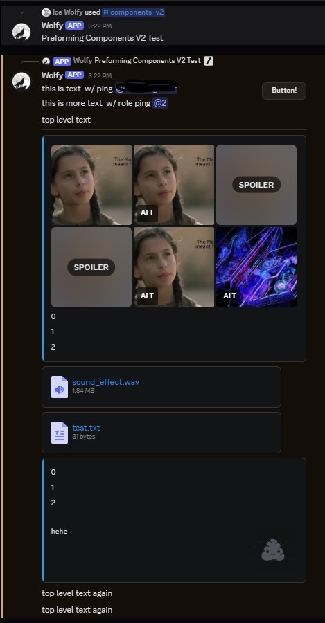

# CV2 Examples

This repository shows examples of Discord's components V2 can be used. Each directory is a user ID of a user to whom the examples belong.

## User: 150665783268212746

#### pollbuilder.png

## User: [451848182327148554](discord://-/users/451848182327148554)

#### image2.png

#### random.png

#### image.png

